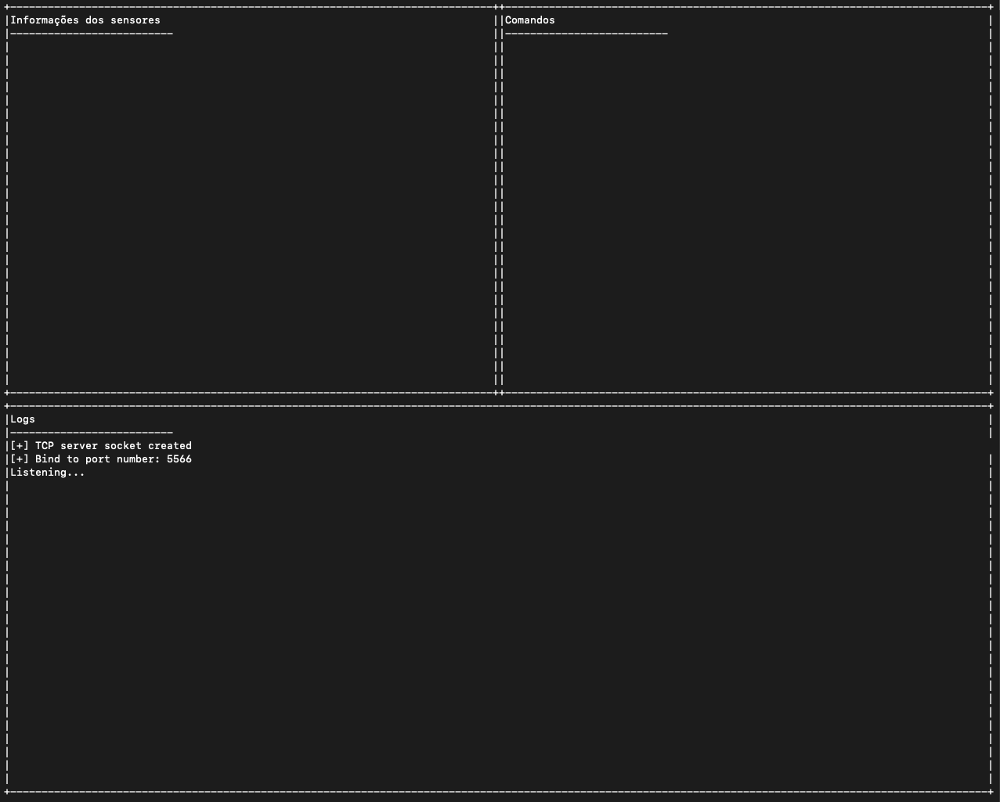
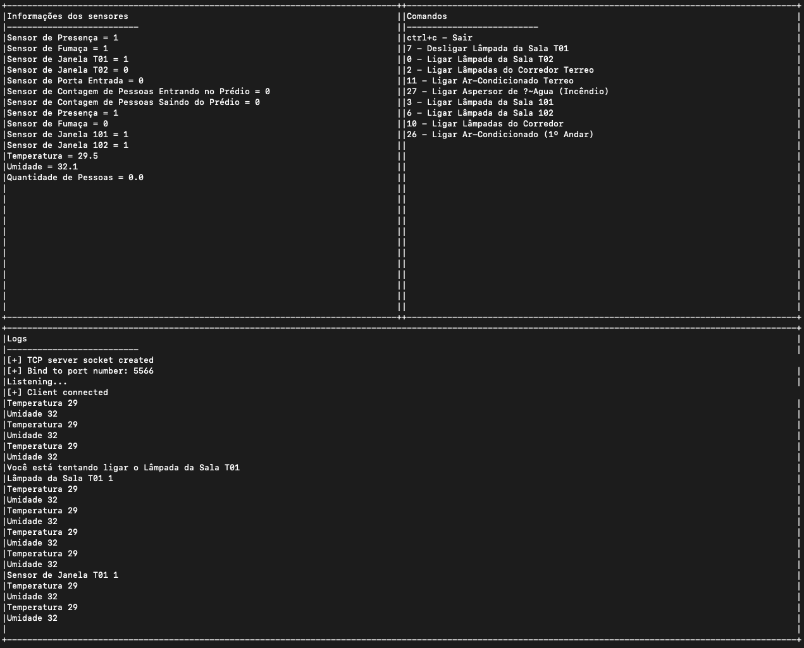

# Trabalho 2 - FSE

## **Resumo**

Este projeto é o segundo trabalho da matéria de Fundamentos de Sistemas Embarcados da Universidade de Brasília (UnB) no semestre 2021.1.

Este trabalho tem por objetivo a criação de um sistema distribuído de automação predial para monitoramento e acionamento de sensores e dispositivos de um prédio de 2 andares. O sistema deve ser desenvolvido para funcionar em um conjunto de placas Raspberry Pi com um servidor central responsável pelo controle e interface com o usuário e servidores distribuídos para leitura e acionamento dos dispositivos. Dentre os dispositivos envolvidos estão o monitoramento de temperatura e umidade, sensores de presença, sensores de fumaça, sensores de contagem de pessoas, sensores de abertura e fechamento de portas e janelas, acionamento de lâmpadas, aparelhos de ar-condicionado, alarme e aspersores de água em caso de incêndio.

|Nome|Matrícula|
|----|---------|
|Calebe Rios de Sousa Mendes|15/0120702|

## **Como rodar**

O projeto utiliza o `Makefile` para compilar e rodar tudo. Alguns comandos para se utilizar:

Para compilar o projeto:
```bash
make all
```

Para rodar o projeto:
```bash
make run
```

Para limpar o projeto:
```bash
make clean
```

Para ligar cada serviço é necessário entrar na pasta `central` e `distributed`.

**IMPORTANTE!**
A ordem correta de ligar os serviços é primeiro a `central` e logo após o `distributed`.

## **Como funciona**

O serviço `distributed` tem alguns logs do que esta acontecendo, mas pode observar tudo através do serviço `central`, como podemos observar na imagem a seguir na parte de logs:



A parte de informações dos sensores, mostra os sensores do tipo `input` e seus respectivos valores.

Já a sessão de Comandos, mostra os sensores do tipo `output` e número a ser digitado necessário para ligar/desligar aquele pino. No caso é necessário digitar o valor correspondente e apertar `enter` para que o sistema reconheça e ligue/desligue o pino.

Na imagem a seguir, podemos ver o sistema completo com já com o serviço `distributed` conectado na `central`:



## **Mais informações**

Neste projeto foram utilizados as seguintes bibliotecas:

- cJson
- BCM2835
- WiringPI
- SoftPWM
- TCP/IP
